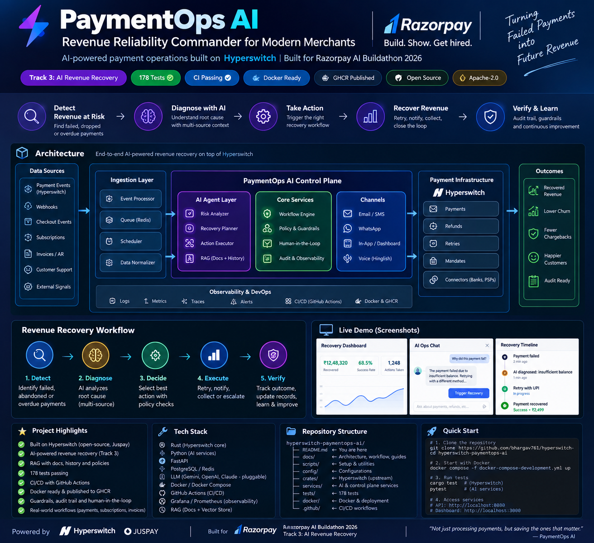

⚡ PaymentOps AI
Revenue Reliability Commander
AI-powered revenue recovery control plane for payment infrastructure
Detect → Diagnose → Quantify ₹ Risk → Decide → Recover → Verify → Measure → Audit
PaymentOps AI is an AI-assisted revenue reliability and recovery control plane designed for modern payment infrastructure.
It combines DevOps, DevSecOps, SRE, AIOps, LLMOps, observability, policy enforcement, controlled remediation, GitOps and revenue intelligence into one engineering workflow.
> **Do not only detect failed payments. Understand why revenue is at risk, decide what can safely be done, recover the payment path, verify the result and measure the revenue protected or recovered.**
---
🏆 Razorpay AI Buildathon 2026
Track: AI Revenue Recovery
Project: PaymentOps AI — Revenue Reliability Commander
Core Idea
Traditional payment operations often stop at:
```text
Payment Failed
      ↓
Retry
      ↓
Payment Recovered / Failed
```
PaymentOps AI expands this into a complete reliability loop:
```text
Payment
   ↓
Telemetry / Events / Webhooks
   ↓
Detection
   ↓
AI Diagnosis
   ↓
Revenue Risk Quantification
   ↓
Incident Commander
   ↓
Policy / Safety Gate
   ↓
Controlled Recovery
   ↓
Queue / Worker
   ↓
Verification
   ↓
Observability
   ↓
Revenue Measurement
   ↓
Audit + Learning
```
---
🚨 Problem
Payment systems operate across multiple components:
Payment APIs
Routers
Databases
Webhooks
Queues
Workers
Payment connectors
Risk systems
Authentication
Infrastructure
Observability systems
External dependencies
A failure in any layer can create:
Payment failures
Increased latency
Webhook delays
Retry storms
Duplicate operations
Connector degradation
Revenue leakage
Customer impact
Operational overload
The operational problem is not simply:
> **"Which payment failed?"**
The real question is:
> **"Which failure is affecting revenue, why is it happening, what recovery action is safe, and did that action actually recover revenue?"**
---
💡 Solution
PaymentOps AI acts as a Revenue Reliability Commander.
It connects payment telemetry, incident intelligence, AI reasoning, deterministic safety controls, recovery automation and revenue measurement.
Complete Control Loop
```text
DETECT
  ↓
DIAGNOSE
  ↓
QUANTIFY REVENUE RISK
  ↓
DECIDE
  ↓
APPLY SAFETY / POLICY
  ↓
RECOVER
  ↓
VERIFY
  ↓
MEASURE
  ↓
AUDIT
  ↓
LEARN
```
This makes recovery:
AI-assisted
Policy-controlled
Observable
Auditable
Revenue-aware
Bounded
Repeatable
---
🏗️ Complete System Architecture

The architecture connects the payment layer, telemetry, AI reasoning, revenue intelligence, recovery engine, observability and GitOps-oriented infrastructure.
---
🔄 Revenue Recovery Workflow
```text
┌─────────────────────────┐
│ Payment Infrastructure  │
└────────────┬────────────┘
             │
             ▼
┌─────────────────────────┐
│ Events / Webhooks       │
│ Metrics / Logs          │
└────────────┬────────────┘
             │
             ▼
┌─────────────────────────┐
│ Detection Engine        │
└────────────┬────────────┘
             │
             ▼
┌─────────────────────────┐
│ AI Diagnosis            │
│ Root Cause Analysis     │
└────────────┬────────────┘
             │
             ▼
┌─────────────────────────┐
│ Revenue Risk Engine     │
│ ₹ Exposure              │
└────────────┬────────────┘
             │
             ▼
┌─────────────────────────┐
│ Incident Commander      │
└────────────┬────────────┘
             │
             ▼
┌─────────────────────────┐
│ Policy / Safety Gate    │
└────────────┬────────────┘
             │
             ▼
┌─────────────────────────┐
│ Recovery Decision       │
└────────────┬────────────┘
             │
             ▼
┌─────────────────────────┐
│ Queue / Worker          │
└────────────┬────────────┘
             │
             ▼
┌─────────────────────────┐
│ Controlled Recovery     │
└────────────┬────────────┘
             │
             ▼
┌─────────────────────────┐
│ Verification            │
└────────────┬────────────┘
             │
             ▼
┌─────────────────────────┐
│ Revenue Measurement     │
└────────────┬────────────┘
             │
             ▼
┌─────────────────────────┐
│ Audit / Timeline        │
└─────────────────────────┘
```
---
🧠 AI Intelligence Layer
PaymentOps AI uses AI where reasoning provides value.
AI Responsibilities
Incident interpretation
Root-cause reasoning
Failure classification
Recovery recommendation
Operational explanation
Context retrieval
Revenue-risk explanation
Incident summarization
The AI layer can reason over:
Payment events
Incident context
Historical operational knowledge
Service state
Recovery history
Revenue impact
---
🛡️ AI Safety Principle
A central design principle is:
> **AI can recommend. Deterministic controls decide what is allowed.**
The system therefore separates:
```text
AI Reasoning
     │
     ▼
Recommendation
     │
     ▼
Policy Engine
     │
     ▼
Safety Controls
     │
     ▼
Approved Action
     │
     ▼
Execution
```
This reduces the risk of unrestricted autonomous actions.
---
🔐 Security & DevSecOps
PaymentOps AI incorporates security controls into the recovery workflow.
Key concepts include:
Authentication
Authorization
Policy enforcement
Controlled remediation
Bounded actions
Audit trails
Secrets protection
Dependency security
Container security practices
Non-root/container security patterns
Kubernetes security patterns
Network isolation concepts
Admission-policy concepts
The system is designed around least privilege and controlled automation.
---
💰 Revenue Intelligence
Payment reliability becomes meaningful when it is connected to business impact.
PaymentOps AI tracks concepts such as:
```text
Payment Failure
      ↓
Affected Transactions
      ↓
Estimated Revenue Exposure
      ↓
Recovery Attempt
      ↓
Successful Recovery
      ↓
Revenue Protected / Recovered
```
Instead of only showing:
```text
Error rate = 8%
```
the system can reason in terms of:
```text
Incident
   ↓
Affected payment volume
   ↓
Estimated revenue exposure
   ↓
Recovery action
   ↓
Recovery result
   ↓
Revenue outcome
```
This connects SRE and DevOps operations directly to business reliability.
---
🚑 Incident Commander
The Incident Commander coordinates the operational response.
It brings together:
Incident state
Failure classification
Revenue exposure
AI diagnosis
Recovery recommendations
Policy decisions
Recovery execution
Verification
Timeline
Audit information
Conceptually:
```text
Incident
   │
   ├── What failed?
   ├── Why did it fail?
   ├── Who is affected?
   ├── How much revenue is exposed?
   ├── What recovery is possible?
   ├── Is recovery safe?
   ├── Was approval required?
   └── Did recovery work?
```
---
⚙️ Recovery Engine
The recovery engine converts approved decisions into controlled actions.
Recovery can include:
Retry decisions
Connector-aware routing decisions
Recovery workflows
Bounded remediation
Queue-based execution
Worker processing
Verification
Failure handling
The system avoids uncontrolled retry behavior by placing recovery behind policy and safety controls.
---
📬 Recovery Queue & Worker
Recovery actions are separated from the decision layer.
```text
Recovery Decision
       ↓
Recovery Queue
       ↓
Worker
       ↓
Execute Action
       ↓
Verify
       ↓
Record Result
```
This separation improves:
Reliability
Isolation
Retry control
Operational safety
Scalability
Auditability
---
👀 Observability
PaymentOps AI follows an observe → act → verify model.
```text
Telemetry
   ↓
Detection
   ↓
Diagnosis
   ↓
Action
   ↓
Telemetry
   ↓
Verification
```
The observability layer follows standard cloud-native concepts such as:
Metrics
Logs
Traces
OpenTelemetry
Prometheus
Grafana
Loki
Tempo
The objective is not only to execute recovery but to prove whether recovery improved system and revenue reliability.
---
📊 Revenue Reliability API
The backend exposes revenue-reliability capabilities through APIs.
These APIs provide structured access to:
Revenue exposure
Recovery state
Reliability information
Incident information
Recovery outcomes
Operational metrics
This creates a machine-readable control-plane interface for dashboards, automation and future integrations.
---
🧩 Architecture Principles
1. AI is not the final authority
AI provides intelligence and recommendations.
Deterministic policy controls decide what can execute.
2. Recovery must be bounded
Automation should operate inside predefined safety boundaries.
3. Every action should be observable
Recovery without verification is incomplete.
4. Revenue is a first-class reliability metric
Technical health should connect to business impact.
5. Decisions should be auditable
The system should explain:
```text
What happened?
Why?
What was recommended?
What was allowed?
What executed?
What happened afterward?
```
6. Infrastructure changes should remain controlled
GitOps-oriented workflows provide traceability and controlled infrastructure evolution.
---
☁️ Cloud-Native Platform
The project is designed around cloud-native engineering patterns.
```text
Application
    ↓
Containers
    ↓
Container Registry
    ↓
Kubernetes
    ↓
Helm
    ↓
GitOps
    ↓
Controlled Deployment
    ↓
Observability
```
The Kubernetes/GitOps layer is treated as the infrastructure delivery pattern around the PaymentOps AI control plane.
Production deployment infrastructure is intentionally separated from the local/demo environment.
---
🔧 DevOps / GitOps Architecture
```text
Developer
    │
    ▼
Git Repository
    │
    ▼
CI
    │
    ├── Backend Tests
    ├── Dependency Audit
    ├── Frontend Build
    └── Container Build
    │
    ▼
Container Registry
    │
    ▼
GitOps / Deployment Layer
    │
    ▼
Kubernetes
    │
    ▼
PaymentOps AI
    │
    ▼
Observability
```
This creates a repeatable engineering delivery path.
---
🧪 Engineering Validation
The project was validated through automated backend and frontend checks.
Backend
```text
178 tests passed
1 non-blocking warning
```
Validation included:
API behavior
Revenue reliability logic
Recovery workflows
Safety controls
Policy decisions
Queue/worker behavior
AI gateway behavior
Integration behavior
CI/CD
The engineering pipeline includes:
Backend tests
Dependency audit
Frontend npm audit
Frontend build
Backend Docker build
Frontend Docker build
Container publishing
Git-based delivery workflow
---
🚢 Container Delivery
The project includes containerized application components and container delivery through CI/CD.
High-level flow:
```text
Git Push
   ↓
CI Validation
   ↓
Docker Build
   ↓
Validation
   ↓
Container Registry
```
This provides reproducible application packaging and delivery.
---
🗂️ Project Structure
```text
PaymentOps-AI/
│
├── control-plane/
│   │
│   ├── app/
│   │   ├── api/
│   │   ├── services/
│   │   ├── recovery/
│   │   ├── ai/
│   │   └── ...
│   │
│   ├── tests/
│   │
│   ├── docs/
│   │   └── paymentops-ai/
│   │       ├── architecture.svg
│   │       ├── paymentops-ai-architecture.png
│   │       ├── architecture.md
│   │       ├── payment-flow.md
│   │       ├── recovery-flow.md
│   │       └── ai-safety.md
│   │
│   ├── Dockerfile
│   ├── README.md
│   └── ...
│
└── upstream/
    └── hyperswitch/
```
---
🏗️ Engineering Journey
The project evolved through multiple engineering phases.
Phase	Engineering Capability
Phase 0	Foundation & Architecture
Phase 1	Payment Application Foundation
Phase 2	Risk + Incident + Recovery Controls
Phase 3	Recovery Decision / Policy Gate
Phase 4	AI / RAG + Integrations + Routing
Phase 5	Structured PaymentOps AI
Phase 6	Resilience / Recovery Safety
Phase 7	Autonomous Recovery Control Plane
Phase 8	Recovery Queue / Worker
Phase 9	Closed-Loop Revenue Reliability
Phase 10	Revenue Reliability API
Phase 11	AI Ops / LLM Gateway
Phase 12	Cloud-Native / Kubernetes / GitOps Engineering Layer
The phases build toward one continuous control plane rather than isolated features.
---
🎯 Razorpay Track 3 Mapping
PaymentOps AI is designed around the AI Revenue Recovery problem.
Revenue Detection
Detect payment reliability issues affecting transaction success.
Revenue Diagnosis
Use AI and operational context to understand the failure.
Revenue Quantification
Translate technical incidents into revenue exposure.
Recovery Decision
Determine whether recovery is appropriate.
Safe Recovery
Apply deterministic policies and bounded remediation.
Recovery Verification
Observe the system after action.
Revenue Measurement
Measure protected or recovered revenue.
Learning
Persist operational context and outcomes for future intelligence.
---
🏭 Industry Applications
Fintech
Payment failure recovery
Transaction reliability
Connector degradation
Revenue protection
E-commerce
Checkout failures
Order-processing failures
Payment gateway incidents
Cart conversion protection
Banking
Transaction processing reliability
API incident response
Service degradation
Operational automation
SaaS
Subscription payment failures
Billing recovery
Service reliability
Revenue protection
Marketplaces
Seller/buyer transaction failures
Payment routing
Settlement reliability
Operational recovery
Digital Platforms
API reliability
Revenue-impacting incidents
Automated incident response
Business-aware SRE
---
📈 Business Impact
PaymentOps AI connects engineering metrics to business outcomes.
Instead of treating reliability as only:
```text
CPU
Memory
Latency
Errors
```
it introduces:
```text
Reliability
     +
Payment Success
     +
Revenue Exposure
     +
Recovery Success
     =
Revenue Reliability
```
This gives engineering and business teams a common operational language.
---
🆚 Why PaymentOps AI?
Traditional Payment Operations	PaymentOps AI
Detect failure	Detect failure
Retry transaction	Diagnose root cause
Technical metrics	Revenue-aware metrics
Manual incident response	AI-assisted incident command
Unbounded retry risk	Policy-controlled recovery
Limited verification	Closed-loop verification
Operational logs	Auditable decision timeline
Infrastructure monitoring	Revenue reliability
Isolated automation	Integrated control plane
---
🧠 Key Differentiator
The strongest differentiator is the combination of:
```text
DevOps
   +
DevSecOps
   +
SRE
   +
AIOps
   +
LLMOps
   +
Payment Operations
   +
Revenue Intelligence
```
into one control plane.
The AI does not replace reliability engineering.
It strengthens it.
---
🔐 AI + Deterministic Reliability
The architecture deliberately separates intelligence from authority.
```text
                 ┌───────────────────┐
                 │       AI          │
                 │ Reason / Diagnose │
                 │ Recommend         │
                 └─────────┬─────────┘
                           │
                           ▼
                 ┌───────────────────┐
                 │ Policy Engine     │
                 │ Safety Controls   │
                 │ Guardrails        │
                 └─────────┬─────────┘
                           │
                           ▼
                 ┌───────────────────┐
                 │ Recovery Engine   │
                 └─────────┬─────────┘
                           │
                           ▼
                 ┌───────────────────┐
                 │ Queue / Worker    │
                 └─────────┬─────────┘
                           │
                           ▼
                 ┌───────────────────┐
                 │ Verification      │
                 └───────────────────┘
```
This is the foundation for safe AI-assisted operations.
---
📸 Project Visuals
Complete Architecture

Architecture Source
The architecture is also maintained as an SVG:
```text
docs/paymentops-ai/architecture.svg
```
Supporting documentation is maintained under:
```text
docs/paymentops-ai/
```
---
🎬 Demo Story
A typical PaymentOps AI incident can be demonstrated as:
```text
1. Payment failures increase
        ↓
2. Detection identifies abnormal behavior
        ↓
3. AI diagnoses likely cause
        ↓
4. Revenue engine estimates exposure
        ↓
5. Incident Commander creates recovery decision
        ↓
6. Policy engine evaluates safety
        ↓
7. Approved recovery enters queue
        ↓
8. Worker executes bounded action
        ↓
9. System verifies outcome
        ↓
10. Revenue impact is recalculated
        ↓
11. Timeline and audit record are updated
```
The final question is not:
> "Did the automation run?"
It is:
> **"Did the system recover safely and protect revenue?"**
---
🛠️ Technology Stack
Payment Infrastructure
Hyperswitch-oriented payment architecture
Payment APIs
Payment routing
Webhooks
Transaction workflows
Backend
Python
FastAPI
REST APIs
Automated testing
AI
LLM gateway
AI diagnosis
RAG-oriented intelligence
Structured AI operations
Reliability
Incident management
Recovery engine
Queue / worker architecture
Policy engine
Safety controls
Verification
Observability
OpenTelemetry
Prometheus
Grafana
Loki
Tempo
DevOps
Git
GitHub
Docker
CI/CD
Container registry
Cloud Native
Kubernetes
Helm
GitOps patterns
Argo-oriented deployment architecture
---
🔍 Hyperswitch Relationship
PaymentOps AI is designed around modern open-source payment infrastructure concepts and integrates naturally with the Hyperswitch ecosystem.
Hyperswitch provides payment infrastructure capabilities such as:
Payment routing
Payment processing
Intelligent routing
Revenue recovery
Webhooks
Observability
PaymentOps AI adds an operational intelligence and revenue-reliability control-plane perspective around those capabilities.
The project can therefore be understood as:
```text
Payment Infrastructure
        +
AI Operations
        +
Reliability Engineering
        +
Revenue Intelligence
        =
PaymentOps AI
```
---
⚠️ Deployment Transparency
This repository demonstrates the engineering architecture, application control plane, automated validation and container delivery workflow.
Important distinctions:
Local/demo infrastructure is not presented as Razorpay production infrastructure.
Synthetic or local test scenarios are not claimed to be real Razorpay production traffic.
Container delivery is not the same as production deployment.
Kubernetes/GitOps architecture represents the cloud-native engineering layer.
External real-money payment execution is not enabled by this project.
Production infrastructure, credentials and real payment-provider operations are outside this repository.
This keeps the project technically ambitious while remaining accurate about what is actually deployed and validated.
---
🧭 Future Production Evolution
A production implementation could extend the control plane with:
```text
Production Payment Telemetry
        ↓
Real-time Revenue Risk
        ↓
Multi-provider Intelligence
        ↓
Kubernetes
        ↓
Argo CD / GitOps
        ↓
Progressive Delivery
        ↓
Advanced SLOs
        ↓
Automated Revenue Reliability
```
Additional enterprise capabilities could include:
Multi-region recovery
Advanced anomaly detection
Connector health scoring
Dynamic routing intelligence
Human approval workflows
Progressive remediation
Advanced cost/revenue optimization
Enterprise audit integrations
---
🏁 Final Architecture
The complete PaymentOps AI vision can be summarized as:
```text
                         PAYMENTOPS AI
                    REVENUE RELIABILITY
                         COMMANDER
                              │
             ┌────────────────┼────────────────┐
             │                │                │
             ▼                ▼                ▼
        PAYMENT           AI / RAG        OBSERVABILITY
      INFRASTRUCTURE       INTELLIGENCE       │
             │                │               │
             └────────┬───────┴───────┬───────┘
                      │               │
                      ▼               ▼
                 DETECTION       DIAGNOSIS
                      │               │
                      └───────┬───────┘
                              ▼
                     REVENUE RISK
                              │
                              ▼
                     INCIDENT COMMAND
                              │
                              ▼
                     POLICY / SAFETY
                              │
                              ▼
                     RECOVERY DECISION
                              │
                              ▼
                      QUEUE / WORKER
                              │
                              ▼
                       REMEDIATION
                              │
                              ▼
                        VERIFICATION
                              │
                              ▼
                    REVENUE MEASUREMENT
                              │
                              ▼
                       AUDIT / LEARN
                              │
                              └───────────────┐
                                              │
                                              ▼
                                      CONTINUOUS
                                       RELIABILITY
```
---
⭐ Project Statement
> **PaymentOps AI is a revenue-aware AIOps control plane for payment infrastructure that combines AI diagnosis with deterministic safety, controlled recovery, observability, GitOps-oriented delivery and measurable revenue outcomes.**
---
Built for AI Revenue Recovery
Detect the failure.
Understand the cause.
Quantify the revenue risk.
Recover safely.
Verify the outcome.
Measure the revenue protected.
Learn from the incident.
---
📌 Repository
PaymentOps AI — Revenue Reliability Commander
Built as an engineering-focused AI revenue recovery platform for the Razorpay AI Buildathon 2026.
